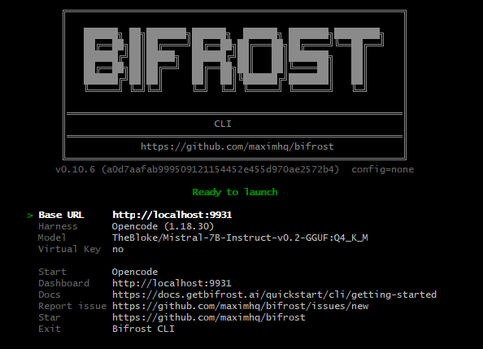

test


https://agentskills.io/specification


docker-compose.yml

# Start the llama cpp server on host
https://discuss.huggingface.co/t/top-local-ai-models-gguf-for-complete-web-app-development-no-coding-for-2026/174336/2

https://www.reddit.com/r/LocalLLaMA/comments/1aegy3v/eli5_whats_the_difference_between_a_chat_llm_and/

Instruct - single turn chat

Chat - multi-turn chat.

https://insiderllm.com/guides/context-length-exceeded-fix/

request (7663 tokens) exceeds the available context size (4096 tokens), try increasing it


```
HF_HUB_CACHE=./models llama cli -hf unsloth/Qwen3.5-9B-GGUF:Q6_K --reasoning off -n 1000 --verbose-prompt --single-turn --temp 0.0 -p "hi"

HF_HUB_CACHE=./models llama cli -hf Qwen/Qwen2.5-Coder-1.5B-Instruct-GGUF:Q2_K --reasoning off -n 1000 --verbose-prompt --single-turn --temp 0.0 -p "hi"

HF_HUB_CACHE=./models llama cli -hf ggml-org/Qwen2.5-Coder-1.5B-Q8_0-GGUF:Q8_0 --reasoning off -n 1000 --verbose-prompt --single-turn --temp 0.0 -p "hi"


llama cli -hf unsloth/GLM-5.3-Flash-GGUF:UD-Q4_K_XL
HF_HUB_CACHE=./models llama cli -hf TheBloke/Mistral-7B-Instruct-v0.2-GGUF:Q4_K_M --reasoning off -n 1000 --verbose-prompt --single-turn --temp 0.0 -p "hi"

LLAMA_ARG_PORT=9931 LLAMA_ARG_VERBOSE=1 LLAMA_ARG_HOST=0.0.0.0 HF_HUB_CACHE=./models llama server --ctx-size 16096
```


# Start ubuntu for the devin client

```
docker compose up --build
docker compose exec -it ubuntu-basic bash
curl -fsSL https://cli.devin.ai/install.sh | bash
```

Should be setup with volumes so this is only necessary when the volume is destroyed.

lrwxrwxrwx 1 root root 56 Sep 13 19:56 /root/.local/bin/devin -> /root/.local/share/devin/cli/_versions/current/bin/devin
Restart your shell or run: source /root/.bashrc. Then run devin to get started.

enter the token manually


Restart your shell or run: source /root/.bashrc. Then run devin to get started.
So include a volume for this so it isn't lost?


<!-- root@4bb4deb48d83:/data# ls ~/.local/bin/devin 
/root/.local/bin/devin -->


# Start bifrost on host

```
nvm use 24

npx -y @maximhq/bifrost -app-dir ./my-bifrost-data --port 9932
```

http://localhost:9931 as the ollama server


```
curl -X POST http://localhost:9932/v1/chat/completions \
  -H "Content-Type: application/json" \
  -d '{"model":"TheBloke/Mistral-7B-Instruct-v0.2-GGUF:Q4_K_M", "messages":[{"role":"system","content":""},{"role":"user","content":"hi"}]}'
```


# Point devin to bifrost

https://docs.devin.ai/desktop/devin-local

https://docs.devin.ai/cli/extensibility/configuration


```
docker compose exec -it ubuntu-basic bash


devin --model opus -- refactor this module

https://docs.getbifrost.ai/quickstart/cli/getting-started
```


# Bifrost cli on docker container

```
docker compose exec -it ubuntu-basic bash

http://host.docker.internal.gateway:9932
```

# Bifrost cli
https://docs.getbifrost.ai/quickstart/cli/getting-started
```
npx -y @maximhq/bifrost-cli
bifrost
```

http://localhost:9931


 npm install -g opencode-ai


opencode-ai acks as the harness.





start opencode


https://learn.chatgpt.com/docs/codex/cli


https://opencode.ai/docs/


```
opencode-ai
```